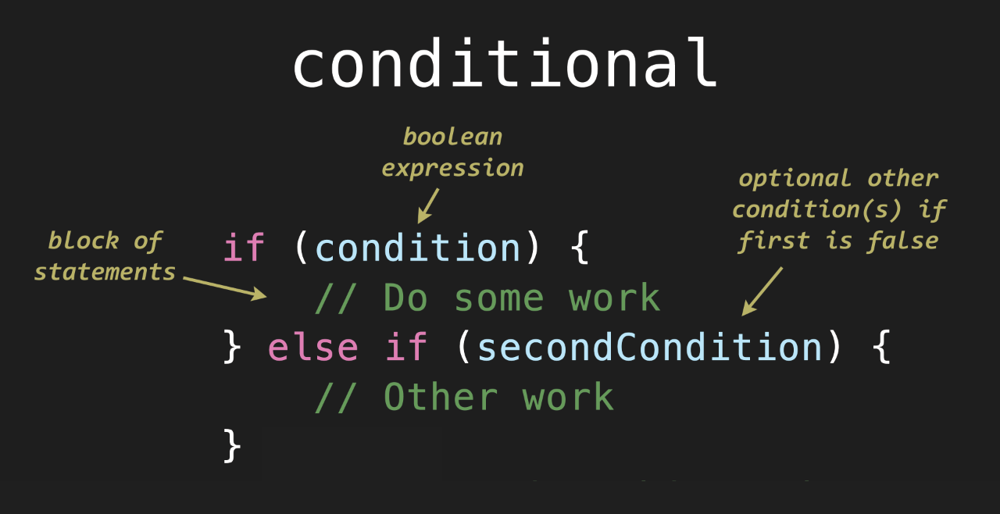

# Unit 3 - Conditionals and Loops

## 3.2 - Else-If

##### ICS3 - Mr. Brash 🐿️

<table>
<tr>
<th>
3.2 - In this Lesson:
</th>
<th>
Unit 3 - Conditionals & Loops
</th>
</tr>
<tr>
<td td valign="top" style="height: 100px;padding-right:50px">
<ul>
<li><a href="#lesson">Else-If Syntax</a></li>
<li><a href="#examples">Examples</a></li>

<li><a href="#practice-time">Practice Time!</a></li>
<ul>
<li><a href="#part-1---menu">Part 1 - Menu</a></li>
<li><a href="#part-2---and-and-or">Part 2 - AND & OR</a></li>
</ul>
</ul>
</td>
<td td valign="top" style="height: 100px;padding-right:50px">

- [README](../../README.md)
- [3.1 - If](./1%20-%20IF.md)
- [3.2 - Else-If](./2%20-%20Else-If.md)
- [3.3 - Else](./3%20-%20Else.md)
- [3.4 - While](../2%20-%20Loops/4%20-%20While.md)
- [3.5 - Interlude: `Strings`](../2%20-%20Loops/5%20-%20Interlude_Strings.md)
- [3.6 - Do...While](../2%20-%20Loops/6%20-%20Do-While.md)
- [3.7 - For](../2%20-%20Loops/7%20-%20For.md)

</td></tr></table>

---

### Lesson:

The `if-statement` allows us to make decisions with code:
```JS
if (age >= 60) {
    console.log("You old!")
}
```

**But what if we needed to make *several* decisions based on fairly complex conditions?**

For example - the user selects a colour based on a number:
```JS
let selection = prompt("Enter 1 for red, 2 for blue, 3 for green, 4 for purple")

if (selection == 1) {
    // Do something for red
}

if (selection == 2) {
    // Do something else for blue
}

if (selection == 3) {
    // Do something else for green
}

if (selection == 4) {
    // Do something else for purple
}
```

In the above example, the computer will check the variable `selection` **FOUR** times, no matter what - even if the selection was "1". *That could be a lot of wasted checking.*


<div style="text-align:center;"><p>The <code>if-statement</code> has another optional piece that will help with this scenario.</p></div>

The `else if` block(s) will *only* be checked if the condition above it was `false`.

### Example:

##### [Top ⬆](#32---else-if)

Let's retry our colour selection again, using `else if`:
```JS
let selection = prompt("Enter 1 for red, 2 for blue, 3 for green, 4 for purple")

if (selection == 1) {
    // Do something for red
} else if (selection == 2) {
    // Do something else for blue
} else if (selection == 3) {
    // Do something else for green
} else if (selection == 4) {
    // Do something else for purple
} 
```
In the code above, if the user enters "2", the code will check if it's equal to 1 (it's not), then check if it's equal to 2 (it is) and it will **NOT** check any of the other conditions - it will run the block of code for `== 2` and then _skip over the rest of the else-if statements_.

**Note:** You can have as many `else if` statements as you need but only *one* `if` at the beginning.

### Final Notes:


- In case you missed it, to get the **_length_ of a String**, we  use `.length`<br>For Example:<br>
  ```JS
  let name = "Mr. Squirrel";
  console.log("Your name is", name.length, "characters long.");
  ```
- The internet is full of [tutorials](https://javascript.info/ifelse), [more tutorials](https://www.w3schools.com/js/js_if_else.asp), and [examples](https://www.google.com/search?q=if+else+statement+example) about the if-else statement since it is one of the very first constructs people learn in programming.


## Practice Time!
##### [Top ⬆](#32---else-if)

### Part 1 - Menu

Menus are a good example of using `if-statements` to control the flow of a program. **Create the function `menu()` that does the following:**

1. Display a menu to the user (copy this):  
    ```JS
    // Setup the menu
    let message = `Hi! Please make a selection:
    1 - Play
    2 - Options
    3 - DLC
    4 - Check for Updates
    5 - Exit
    `
    // Prompt with the menu
    let selection = Number(prompt(msg));
    ```

    Whatever number they select will be stored in `selection`.  

2. Based on what the user selects, use an `if-statement` and `else-if` statements to output (`alert`) the following:

    | Value | Output |
    |---|---|
    |1|"Let's play!"|
    |2|"You selected Options."|
    |3|"No new DLC at this time."|
    |4|"Everything is up to date."|
    |5|"Bye!"|

3. If the user selects `1 - Play`, we should then ask them a difficulty level of `1 - Easy`, `2 - Medium`, or `3 - Hard`.  
After you alert "Let's play!", prompt the user for their selection of difficulty.  <br><br>
Depending on what they select, output the following:
    | Value | Output |
    |---|---|
    |1|"You selected the easy route."|
    |2|"Most people select medium."|
    |3|"I see you like a challenge!"|  
  
    > 🤔 Just a thought... what if they don't enter one of _those_ choices?  
     🤷‍♂️ I guess that's for another lesson.
  
<br>

---

### Part 2 - AND and OR


As mentioned in the previous lesson, you can combine _conditions_ with logical "AND" or "OR" operators. For example, to check if a number is between 5 and 10:
```JS
if ((x >= 5) && (x <= 10)) {
    // Do something
}
```

In that example, it is checking if the value is greater than or equal to 5 **and** less than or equal to 10. The symbol for **and** is double ampersands, `&&`. The symbol for **or** is double pipes, `||`.

1. Create the function `greeting(hour)`  

2. `hour` will be a value between 0-23 that is passed to the function (no prompts or alerts). This is [military time](https://en.wikipedia.org/wiki/24-hour_clock).

3. Depending on the value of `hour`, _return_ "Good morning!" (hour is 0-11), "Good afternoon!" (hour is 12-17), or "Good evening!" (hour is 18-23). If the hour is _any other value_, return "Invalid hour!".

### Here's another _optional_ challenge:

##### [Top ⬆](#32---else-if)

**Reminder:** Inside your [main.js](../../main.js) file is the `randInt()` function.

1. Create the function `two_digit()` that does the following:

2. Inside the `two-digit()` function Generate a random two-digit value and then _return_ based on the following:
- If the value is specifically zero, return 0  
- If the value is specficially divisible by 2 _AND_ 3, return "Divisible by 6"

However,
- If the value is `even`, return the word "Even"
- If the value is `odd`, return the word "Odd"
- If the value is **_prime_**, return "Prime"

Keep in mind, not all of those require ELSE-IF.

<br><br>

🐿️

