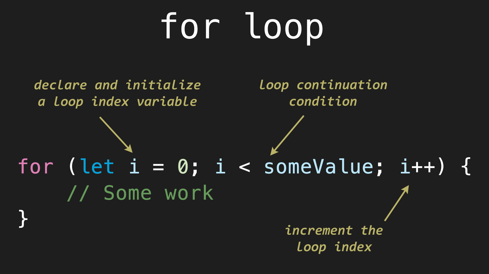

# Unit 3 - Conditionals and Loops

## 3.7 - The For Loop

##### ICS3 - Mr. J 🐠

<table>
<tr>
<th>3.7 - In this Lesson:</th>
<th>Unit 3 - Conditionals & Loops</th>
</tr>
<tr>
<td td valign="top" style="height: 100px;padding-right:50px">

- Lesson - [The For Loop](#lesson)
- [Examples](#more-examples)
- [Practice Time!](#practice-time)
    - [Part 1](#part-1)
    - [Part 2](#part-2)
    - [Even More Practice](https://gist.github.com/MisterBrash/df850424a11413b6660ac0b6b930852a#file-more-conditionals-and-loops-md)
    
</td>
<td td valign="top" style="height: 100px;padding-right:50px">

- [README](../../README.md)
- [3.1 - If](../1%20-%20Conditionals/1%20-%20IF.md)
- [3.2 - Else-If](../1%20-%20Conditionals/2%20-%20Else-If.md)
- [3.3 - Else](../1%20-%20Conditionals/3%20-%20Else.md)
- [3.4 - While](./4%20-%20While.md)
- [3.5 - Interlude: `Strings`](./5%20-%20Interlude_Strings.md)
- [3.6 - Do...While](./6%20-%20Do-While.md)
- [3.7 - For](./7%20-%20For.md)

</td></tr></table>

---

### Lesson:

The `while` and `do...while` loops work on a condition.
```JS
while ((x <= 5) && (paused == false)) {   
  // do something
}
```

A **_lot_** of the time, it involves a counting variable - running the loop a _specific_ number of times:
```JS
do {
  // code
} while (index < 100)
```
_Many_ programmers forget to modify the counting variable, causing an infinite loop.


<div style="text-align:center;">

If you know you'll be _counting_ you could use the **[for loop](https://cs.brash.ca/unit-3/loops/for-loop)**. 

[](https://cs.brash.ca/unit-3/loops/for-loop)

</div>

### It contains three parts, separated by _mandatory_ semicolons:
```JS
for (part1; part2; part3) { 
  // Your code
}
```
- `part1` is the declaration of any indexer or counting variable. Example: `let i = 0;`
- `part2` is _exactly_ like the `while` condition. Example: `i < 10;` (which means _while_ `i` is less than 10)
- `part3` is what will happen to the indexer on each loop iteration. Example: `i++` (increase `i` by 1) or maybe `i += 3` (add 3 to `i`) on each iteration. You can also count down.

### You can increment / decrement by whatever amount you need.
```JS
// Count down from 100 to 1
for (let i = 100; i > 0; i--) {
  ...
}

// Count up by 2's from 10 to 30
for (let j = 10; j <= 30; j += 2) {
  ...
}

// Count down by 5's from max to min
for (let x = max; x >= min; x -= 5) {
  ...
}
```

### More Examples:

###### [⬆ Top](#37---the-for-loop)

Print from 0% to 100% going up by 2.5%
```JS
for (let p = 0; p <= 100; p += 2.5) {
  console.log(p + "%");
}

// Output:
0%
2.5%
5%
...
97.5%
100%
```

Print the alphabet on one line using the character codes:
```JS
let alpha = "";

for (let letter = 65; letter < 91; letter++) {
  alpha += String.fromCharCode(letter);
}

console.log(alpha);
// Prints ABCDEFGHIJKLMNOPQRSTUVWXYZ
```

## Practice Time!

### Part 1

###### [⬆ Top](#37---the-for-loop)

#### Three Functions that Print to the _console_:

1. Write the function `count_up(start, stop)` that prints from `start` to `stop` (inclusive) on the console.  
**Example:**  
    ```JS
    > count_up(5, 8)
    5
    6
    7
    8
    ```

2. Write the function `count_down(start, stop)` that prints _down_ from `start` to `stop` on the console.  
**Example:**  
    ```JS
    > count_down(10, 6)
    10
    9
    7
    6
    ```

3. Write the function `print_chars(str, step)` that prints each individual character of `str` to the console, on its own line, skipping by `step` characters each time.  
**Examples:**  
    ```JS
    > print_chars("Skip by 2", 2)
    S
    i
     
    y
    2
    
    > print_chars("For Loops are fun!", 3)
    F
     
    o
     
    e
    u
    ```

### Part 2

###### [⬆ Top](#37---the-for-loop)

#### Three Functions that _Return_ a value

1. Write the function `sum(n)` which _returns_ the sum (addition) from 1 to `n`. You must use a for-loop to complete it.  
**For Example:** `sum(7)` returns 28 (because 1+2+3+4+5+6+7 = 28)  
   
2. Write the function `count4(begin, end)` that _returns_ **how many** numbers are _divisible by 4_ from `begin` to `end` (inclusive). Use a for-loop to complete it.  
**For Example:** `count4(5, 43)` returns 9 (because 8, 12, 16, 20, 24, 28, 32, 36, 40)
   
3. Write the function `sum_divisible(n, x)` which _returns_ the sum (addition) of the values from 0 to `n` (inclusive) that are _divisible_ by `x`.  
**For Example:** `sum_divisible(32, 6)` returns 90 (because 6+12+18+24+30 = 90)  
 
<br>


---
### Would you like even more challenges?

[Click there for more conditional and looping challenges](https://github.com/ash-comsci/Unit-3-Conditions-and-Looping/blob/a1e30f9a8cc70284e7209e3d96044f3f5f9a62c6/Lessons/2%20-%20Loops/Additional_Lessons.md).


###### [⬆ Back to the Top](#37---the-for-loop)

<br>
🐠
