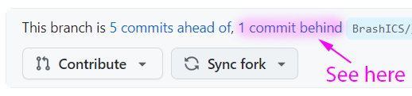
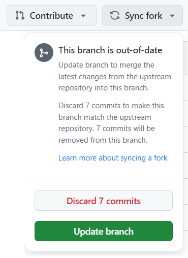
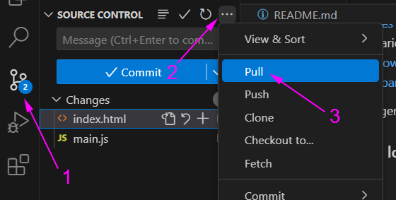

# Updating the lessons

As Mr. Brash updates the repository with lessons and sample code, you will need to synchronize your repository and _pull_ the changes to your VSCode/Codespace. This is a simple process but can cause issues:

1. Go to [your repository for this unit](https://github.com).  

2. If the repository says you are _behind_, select `Sync fork` and then `Update branch` (don't delete your commits!)  

  

 

3. Come back to VSCode/Codespace. Go to the Source Control section, click on the kabob menu (three dots) and select `Pull`.  

  

 

# Merge Conflicts

If you run into a merge conflict or an issue synchronizing with Github _try_ the following:

1. Open a terminal window by going to the menu and selecting `Terminal > New Terminal`  
( the keyboard shortcut is CTRL+SHIFT+` )  

2. In the terminal window enter: `git merge -m "Fixing Conflict"`  
(You can actually put whatever message you want)  

3. Try your commit again in the source control panel.

If you still have issues, contact your teacher.

---